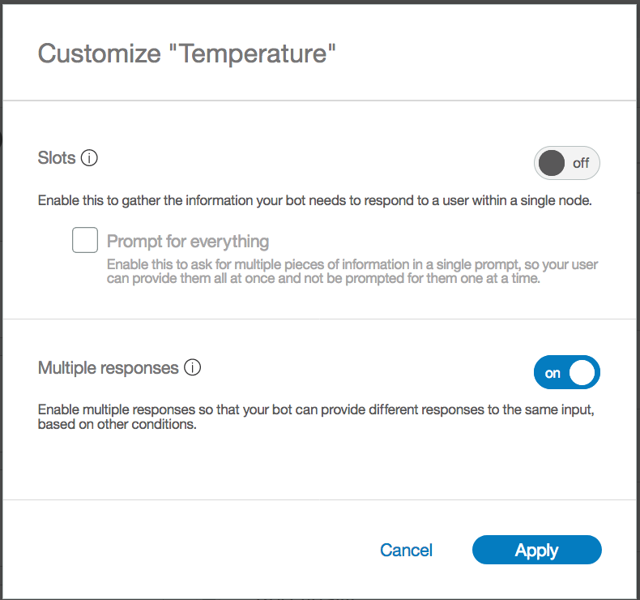
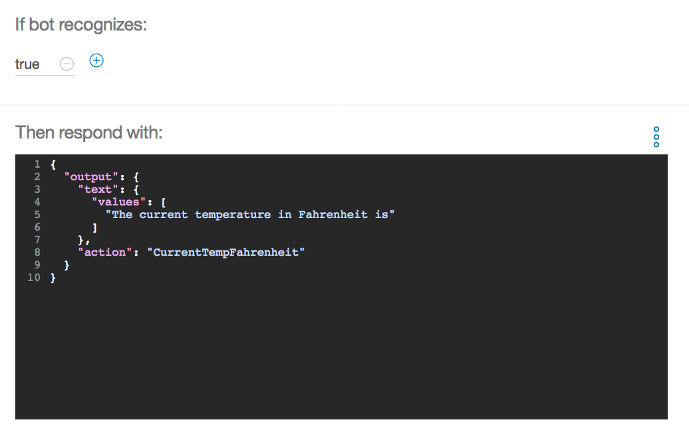
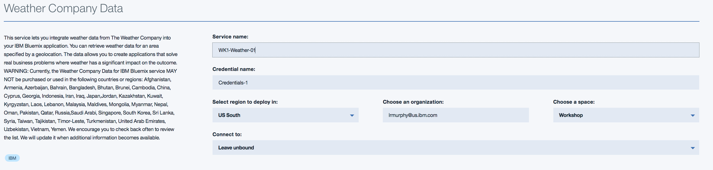
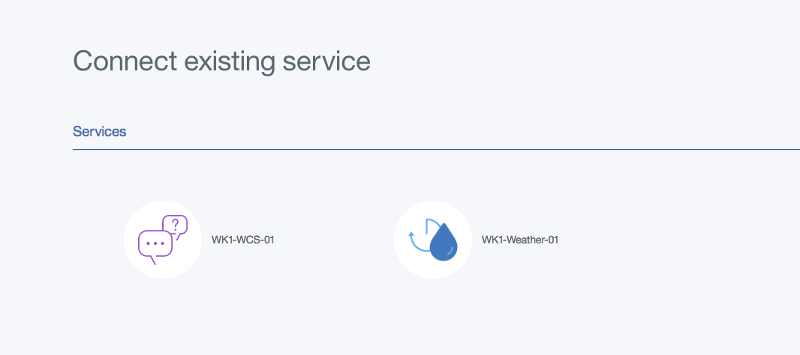

# Workshop: Watson Conversation Service

## Architecture
Below is the architecture overview of the workshop, Watson Conversation Service (WCS). This architecture
is consistent with the reference implementations of WCS for cloud native applications using microservices.


## Application Overview
This workshop is intended to help you understand the basics of the Watson Conversation Service (WCS)
as part of the Watson API's. WCS is a question and answer system that focuses on providing
a dialog type of experience between the user and the conversation system. This style of interaction
is commonly called a bot. The intent of this lab is to leverage the WCS capabilities. We will enable through a dialog approach,
WCS interacting with data from the weather service API and the ability to issue commands to change the color of our dialog background. Though the example is simple, it will provide you with a solid understanding of the core pieces of WCS.

### Terminology
WCS has a couple of terms that need to be understood. This will allow for an easier time with
creating an application (i.e. Dialog) in WCS.

**Intent:** An intent is the intention of the command or question given by the user to WCS.
	It is common to think of intents as the verbs or actions that need to occur. An Example of
	an Intent is "Tell me the temperature" or "I want to know the current temperature". In both
	cases, though the sentences are different they both as asking WCS for temperature information.
	It should be noted that WCS can only support a single Intent per interaction with WCS. So
	asking questions with multiple intents will produce unreliable ordering of answers to the question.

**Entities:** An entity is the object that intents use to help narrow the scope of the request.
	It is common to think of entities as nouns or objects. The nice thing about entities, compared to
	intents, is that you can have multiple entities per interaction. This is very helpful when trying
	to narrow down the answers to a question.

**Dialog:** The conversation that is created within WCS, is called a dialog. A dialog is
	composed of creating a flow between intents and entities. The combination of flows and
	subFlows allows WCS to provide multi-layered conversation based on multiple interactions,
	instead of a single question and answer.

## Prerequisites
You must have a [Bluemix account](https://www.bluemix.net).

## Create Watson Conversation Service


1.Log in to [Bluemix](https://www.bluemix.net)


2.Select the **Catalog** button at the top navigation on the right

3.Select **Watson** on the left navigation under the Platform menu

4.Select **Conversation**


5.In the service name type **WK1-WCS-xx** (where xx is your team number). You can leave credential name as is, if you like.


6.Click **Create** in the lower right corner. You should now see the following:


7.You will need to cut and paste your service credentials. Click on **Service Credentials**
on the left navigation, right under "Manage". Once the page has loaded, click on **View Credentials** on the right side of the screen.
A drop down will show with your specific credentials


Your values will be different than shown.

8.Click the **copy icon** to copy the values to your clipboard. Paste the values in a text file for later use.

9.Go back to the Manage page, by clicking on the **Manage** link on the left side navigation. This will take you back to the manage page.


You have now completed creating the WCS service instance.

## Launch WCS tooling
1.Click on the **Launch tool** icon to take you to the WCS workspace


2.This will open another browser window and you should now be on the Watson Conversation Workspace page


3.You are going to create a new workspace. Click on the **Create a new workspace** tile.

4.Enter a **workspace name** i.e. WK1-xx (where xx is your team number), and select **Create**


5.Click the **last icon (Back to workspaces)** on the left navigation. It should look like


6.You should now see your newly created workspace listed.


7.Click on the **three grey buttons** in the upper right corner of your workspace tile.


8.Click **View Details**. You should now see something like the following


9.Copy the **Workspace ID** and paste it in a text file. **You will need this later in the workshop.**

10.Click on the **White Back Arrow** in the upper corner of the tile.


11.Click **Get Started** or anywhere in the tile, to get started.


## Create Intents
You are now ready to create Intents! Click on the **Intents** link. You should now see the following:


1.Click the **"Create New"** button in the middle of the page. You should now see the following:


2.Add a new Intent name of **Information**.


3.You then need to provide some examples. Copy the samples provided, one at a time, and paste under "User example". Click the "+" button or "Enter" to add each example.

```
What is the temperature
Can you explain
What is a
I need information about
What is the current temperature
I need some information on the temperature
Can you tell me the temperature
I need to know the temperature
```
It should look like the following:


4.Click **Done** in the upper right corner when finished.


5.Add another intent, by clicking **Create new** button.


6.Use the new Intent name of **Greeting**.


7.Copy the samples and click **Done** when finished. Look at the image below.

```
good evening
Hello
Hi
Howdy
Good morning
Good afternoon
Yo Yo Yo
Sup dude
```


8.Add another intent **GoodBye**. Add the following examples also. Click **Done** when finished.

```
Good bye
See you later
talk to you later
Goodbye
later dude
```


9.Add one last intent **ChangeColor** with the following examples:

```
I need to change the color of the sensor
Please change the sensor color
Change the color of the sensor
make the sensors color green
change the sensor color to green

```


10.Click **Done** when finished.

11.You have now finished creating all of the intents. (Nice Job!). You should have created the following intents.


## Create Entities
Next we want to create some **Entities**. Click on the **Entities** link at the top of the page.


1.Click the **Create New** button.

2.Type **Temperature** as the new Entity name.


3.Now notice, you need to add examples of new "Temperature" entities. So add **Current Temperature** as an entity value but you also need to provide some synonyms to help identify variations of the entity value. Now add **Temperature now** and **Current Temp**
as synonyms. When you add a synonym, hit the **Enter** key from your keyboard to add the next synonym. After you are finished with each set of synonyms click the **Plus** icon to add them.


4.You now need to add **Average Temperature** and **Temperature** as entity values with the corresponding
 synonyms, as shown in the image above. Click **Done** when finished.

```
Current temperature		current temp	temperature now
Average temperature		Avg temp		Avg temperature
Temperature 			    Temp

```

If for some reason you accidentally don't add one of the synonyms, you can add it after you click the done button. You just select the entity and add the appropriate synonyms.


5.Create another entity called **Degree** also add the associated synonyms.Click **Done** when finished.

```
Celsius	  celcius	  degrees celsius   degrees in c   degrees c
Fahrenheit		degrees fahrenheit   degrees f	 degrees in f

```


6.Add one last entity called **Colors** and the associated values.Click **Done** when finished.

```
Yellow
Blue
White
Green
Red
Black	off
```


7.Great you now completed the adding of Entities. (Well done!). You should have created the following entities.


## Create a Dialog
We are now ready to create a dialog. Click on the **Dialog** link at the top of the page.


1.Click the **Create** button to start to create a dialog. You should now see the following:


What you see are two "Dialog Nodes". The first is the standard "Welcome" message and the other
is a catch-all "Anything else" . Remember the way a conversation dialog works is by scanning from the top of the tree
and evaluating every node until a condition is met that satisfies the question being asked. So when the conversation starts
WCS will respond with the "Welcome" Node. If you click on the "Welcome" node you will see that the standard Watson response
is "Hello. How can I help you?"


2.We now want to create our own node, based on the "Intents" we create earlier. To add a new node in the tree, click on the **Welcome**
node,  and then click on the **Add Node** icon.


3.You should now see the following:


4.Type **Greetings** as the name of the node. “If bot recognize” should be **#Greeting**. You can provide any response text you like. It should look similar to the following:


5.You can click the **blue X** in the upper right to close the dialog node editor.

6.Again add another root node by clicking on the **Greetings** node and then clicking **Add node**. This node's values are as follows:


7.You can click the **blue X** in the upper right to close the dialog node editor.

8.Add a new node under the **Goodbye** node, called **Change Color**.


9.In this node, your response needs to have a condition set, prior to responding. This is done by clicking on the **Customize** link in the upper right. Change **Multiple responses** to **On**.


10.Click **Apply**. You should now see the following:


11.Make the response condition **@Colors**. For the "response" input:

```
I just changed the color to <? entities.Colors.literal ?>
```


Take special note of the extra information in the first response. Make sure to copy it properly.   

This is an expression language snippet of code. If you look at the information in the node, the intent is to change color and the first condition for a response is "@Colors", which signals to Watson, if a known color is provided in the user's input then use that color in the response.

12.We are going to add a single line of code to the JSON. The purpose of this code, is to send a signal to the NodeRed application that some special processing needs to occur. So for Watson to respond to the @Color entity request, we need to have a new attribute on the JSON object.

13.To change the JSON, select the **Settings Wheel**, which is located to the right of the “Respond with” entry.  You should now see:


14.Select the **3 blue dots** and **Open JSON editor**


15.You should now see:


16.Type **"action": "changeColor"** make sure you put the **"comma"** right after the curly bracket, but before the new code you just added. When done, click **Save**


17.Select **Add response** to add another response. Set the response condition to **true**, and for the “respond with” input:

```
I do not know that color, please train me and try again.
```
18.You should now have the following. When finished, click the **blue X** in the upper right to close the dialog node editor


If an unknown color is typed (i.e. Violet) in the user's input, the processing will hit the "True" condition. This is because "Violet" is not in our "@Color" entity definition.

19.Add a node under "Color Change" called **What else**, with the following information. When finished, click the **blue X** in the upper right to close the dialog node editor.


20.At this point your Dialog Tree should look like the following


21.We are now on the last node we are going to create. Insert this node between the "Goodbye" and "Change Color" node. This is done by clicking on the **Goodbye** node and then clicking **Add Node**.


22.Enter **Information** as the name of the node. In the "If bot recognizes" type **#Information**. **Do not provide any responses.**


23.Click the **blue X** in the upper right to close the dialog node editor.

24.Now you want to create a sub-dialog. This time make sure the **Information** node is selected and then click on the **Add child node** button.


25.Enter **Temperature** as the name of the node.

26.In the "If bot recognizes" field enter **@Temperature:(Current Temperature)**. This is the entity defined earlier.


27.We want to be able to add multiple responses. To do this, select the **Customize** link in the upper right corner. Turn **On** the option “Multiple Responses.” Select **Apply**



28.You should now see:


29.In the Response section, for the first response, type **@Degree:Celsius** in the “if bot recognizes” field. Then add the Watson response of **The current temperature in Celsius is**.


30.We want to add another Watson Response for Degree:Celsius. To do this, select the **Settings Wheel**, which is located to the right of the “Respond with” entry. You should now see:


31.Within the “Add a variation to this response”, type **The temperature in Celsius currently is**. Select **Save** when done.


32.Click **Add response**, to add another response condition of **@Degree:Fahrenheit** with the response message of **"The current temperature in Fahrenheit is"**.


33.Add one last response condition. This is a catch all condition for this node. Set the “if bot recognizes” to **true**. Add the Watson response as **The current temperature in Fahrenheit is**. The reason for this last response to have a response in the event Watson doesn't knows what type of temperature you are looking for. For example, Watson knows you are looking for information about the temperature, but isn't sure if you mean in celsius or fahrenheit. Your completed node should look the like the following:


34.We are going to add a single line of code to the JSON. The purpose of this code, is to send a signal to the NodeRed application that some special processing needs to occur. So for Watson to respond to the **degree:Celsius** entity request, we need to have a new attribute on the JSON object.

35.To change the JSON, select the **Settings Wheel** beside the “Respond with” entry for the condition “@Degree:Celsius”.  You should see:


36.Select the **3 blue buttons** and **Open JSON editor**


37.You should now see:


38.Type **"action": "CurrentTempCelsius"** make sure you put the **"comma"** right after the curly bracket, but before the new code you just added. Select **Save** when done


39.You now need to do the same thing for the each of the other responses on the temperature node. For the **degree:Fahrenheit** response add **"action": "CurrentTempFahrenheit"**


40.Now do it for the **true** condition as well. We will have the default response be in fahrenheit so add **"action": "CurrentTempFahrenheit"**



41.Click the **blue X** in the upper right to close the dialog node editor.

42.We have one last sub-node to create. Under the **Temperature** node, create a new node. This is done by clicking on the **Temperature** node and then clicking on **Add node** button.

  

43.Call it **Unknown** Add the information like below. When finished, click the **blue X** in the upper right to close the dialog node editor.


44.The next step is to go back to the **Information** node, by clicking on the node itself. Next click on the **3 blue buttons** This will open a small menu like the following:   


45.Click on the **Jump to** menu item and then click on the **Temperature** node. You should see the following:   


46.Click on the **If Bot recognized condition** menu item. Your screen should now look like the following:   


47.Next we want to select the **3 blue buttons** on the **Temperature** node. Like with the "Information" node, select the  **Jump to** menu item.


48.Then select the **WhatElse** node. This time select the **Respond** option.


49.The sub-flow should now look like the following:


50.We are now finished with the entire Dialog. Congratulations! Now is time to test your code.

## Weather Company Service & NodeRed Flow

What might become obvious is that the responses from WCS are static. There is nothing personalized in the responses.
Because of this we need to add a layer in front of WCS to take the responses and make them personalized. For this, we are going to use NodeRed. We are also going to use the Weather Company Service to determine the weather at our location (Grapevine, TX).


## Create Weather Service
1.Navigate back to your **bluemix dashboard** tab. And select **Catalog** from the upper right corner.


2.In the search, type **weather** and select the **Weather Company Data** service


3.In the service name type **WK1-Weather-xx** (where xx is your team number). You can leave credential name as is, if you like. Click on **Create** in the lower right corner.



4.You should now see the following


5.You have now completed creating the Weather Company Data service instance.

## Create NodeRed Flow
Next, we are going to create a **Bluemix NodeRed** application.

1.Navigate back to your **bluemix dashboard** tab, and select **Catalog** from the upper right corner.


2.You should now see this


3.Select **Boilerplates** on the left navigation under the Platform menu and select **Node-RED Starter**


4.On the resulting page, you need to give your application a name.  You can name your application anything you like provided it is unique in the Bluemix space. For consistency, this workshop will use the name **myWorkshop-xx** (Replace xx with your team number). Enter your application name in the application name field, and click **Create**.  There is no need to modify any of the other fields on this page.  


5.At this point, your application will be created and, after a few moments, you will be taken to the **Getting Started** page for your application.


6.You now need to create connections to your Weather Service and Watson Conversation services.  Go to the **Connections** section of your application page (listed on the menu to the left). There, as a part of the Node-RED Starter boilerplate, you will see that a Cloudant NoSQL database service has been created automatically.  The Cloudant NoSQL database holds all of your application code. Here, is where you will add the connections to your two additional services.


7.Select **Connect Existing**, on the right, and connect both your Weather and Conversation service. Select **Restage** if prompted to restage the application.



8.You should now having the following:


9.Next, once your application is running, select **Visit App URL** to open the NodeRed editor.


10.Follow the "welcome to NodeRed steps" to secure your Node-Red editor. **Write down your username and password, as they will be needed to log into the Editor.**


11.Select **Finish** to complete the install


12.Upon a successful install, you will be taken to your NodeRed Editor homepage.


13.Select **Go to your Node-RED flow editor** and enter the username and password that was previously created. You should now see the following:


14.Click [WCS NodeRed Flow](https://github.com/team-wolfpack/CnCGroundUp/blob/master/wcs-nodered-flow-start.json) link. This will take you to the NodeRed flow JSON file which has a pre-developed flow for talking to WCS. You should now see:


15.Highlight all of the JSON text and copy it to your clipboard. (ctrl+c on your keyboard).

16.Go back to your NodeRed editor and in the upper right corner is the cake layer icon, click on it. Then click **import** and then click **clipboard**.


17.You should now see the following dialog window:


18.Click in the center of the dialog and paste the information from your clipboard. (ctrl+v). Make sure the **new flow** button is pressed before you import.


19.Your screen should now look something like the following


20.Double click the **Flow 2** tab, to edit the name of the Flow. Change the name to **WCS Flow** and select **Done**.


21.Congratulations, you have created a NodeRED service and imported a starter flow.

### Update NodeRed Flow

Now we need to update a couple of the nodes to include the Watson Conversation and Weather Company service.

1.Now go back to NodeRed and make sure you are in the **WCS Flow** tab.

2.First we will update the Watson Conversation node to point to the conversation service we previously created. Double click the **STSA-CONV** node. Replace the information in the **Workspace ID** with the workspace ID from your conversation service. You recorded this value earlier in the workshop. Click **Done**


3.On the left-side navigation panel, under **Weather**, select the **Weather Insights** node.


4.Drag and drop the Weather Insights node onto the workspace. Connect the **Weather Insights** node to the **Conversation Action** node by clicking and dragging from one connection point to the other.


5.Double click the **Weather Insights** node, to edit the node properties to the following. Select **Done**. For purposes of this lab, we are hardcoding the geo-coordinates **(32.9343,-97.0781)** of Grapevine, TX. The weather service will return the weather for that location.


6.Notice the name of the Weather Insights node on the workspace, is now **Get current temp C**


7.We now need to add another weather Insights node to get weather in Fahrenheit. Drag and drop another **Weather Insights** node onto the workspace and connect it to the Conversation Action node.


8.Double click the node to edit the properties to the following. Select **Done**


9.Again, notice the name of the node is now **Get current temp F**


10.Next, we need to format the information returned from the Weather Service. For this, we will use a **Function** node. On the left-side of the workspace under "Function", select the **function** node.


11.Drag and drop the function node onto the workspace and connect to it the **Get current temp C** and **Get current temp F** nodes.You should now have the following:


12.Double click the function node to edit properties. Name the node **CurrentTemp** and input the following code into the function box. Select **Done**

```
txt = msg.convdata.output.text[0];
temp = msg.observation.temp;
msg.payload = msg.convdata;
msg.payload.output.text[0] =  txt + " " + temp;
return msg;
```


13.Your workspace should now look like the following:


14.The final step is to connect the **CurrentTemp** node to the **http** node


15.Your final NodeRED flow should look like:


16.You are done updating the NodeRed Flows for Watson Conversation Service and the Weather Service. Click the **DEPLOY** button at the top of the screen. You should receive a "Successfully deployed" message.


### Watson Conversation Web Client

The next step is to create a sample application that connects to your NodeRed flow. When you click on the button below, you will be taken to bluemix DevOps page. This will automatically create a new application for you, via the DevOps ToolChain. If you are not logged on to BlueMix you will need to logon.

1.Click the Deploy to BlueMix button below to provision the web client application.

[](https://bluemix.net/deploy?repository=https://github.com/team-wolfpack/WCS-Chatbot-Client.git)

2.You will see a screen like the following:


3.Click the **deploy** button, after about 1 minute or so, but may be longer if BlueMix is slow :-) , your screen will change to something like the following:


4.Click on the **Deliver** tile


5.Then you should see something like the following:


6.Once the message in the deploy tile has changed to Passed from Deploy running, click on the **Rocket** icon under **Last Executed Results**


7.This will take you to the newly created applications. Your screen should now look like:


8.Click on the **Runtime** link on the left and your screen should change, then click on **environment variables** tab in the middle of the screen. It should look like the following:


9.In the **CONVERSATION_URL** value change the "xxxxxx" to the hostname of your **NodeRed** application. This comes from the NodeRed url where you created your NodeRed flow. So something like "myworkshop-xx.mybluemix.net", do not include "/red/#.
Change the **CONVERSATION_PASSWORD** and **CONVERSATION_USERNAME** value to the password and username from your Watson Conversation Service.


Your values will be different

10.Click the **Save** button. The application will restart.

11.Once your application is running, click on the **Visit App URL**. This is at the top of the page. **You will get an error message** or land on the following page.


**or**


12.That is okay. You need to add **webclient** to the end of the browsers URL.


13.Your screen should now look like the following:


### Ask Watson questions
You can now ask Watson questions about the temperature.

1. What is the current temperature in Celsius
2. What is the current temperature
3. What is the current temperature in fahrenheit
4. Change the background color to blue

Ask Watson this question

5. What is the temperature

Did you get the response you were expecting? Why not? (hint: go look at the Temperature dialog node in Watson Conversation)


Nice Job you are now a Jedi Knight in Watson Conversation Service!

### Jedi Knights and Jedi Masters
If you have time, you can start to add more Dialog Nodes to ask other questions and you can provide the appropriate responses. Play with the ordering of the nodes in the dialog tree. Create new child nodes and see how they react to the flow. Also you can always add new entities and intents and then create even more dialog nodes. It is really endless as to what you can do.
